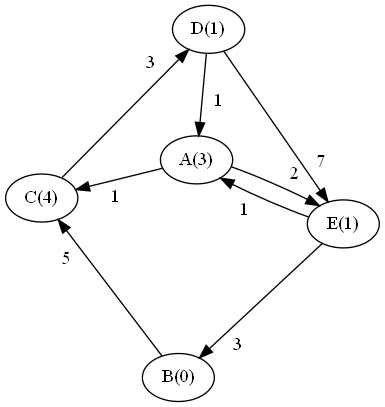

#9-WK-13 Worksheet: Problem Spaces & NP Completeness
##
Collaborators:

Answer the questions below:

## Review

1. Dijkstra's shortest path algorithm is a graph search algorithm that finds the shortest path between a given source node and all other nodes in a weighted graph. It starts by initializing the distances of all nodes to infinity, except for the source node, which is set to zero. The algorithm then repeatedly selects the unvisited node with the smallest known distance, updates the distances of its neighbors, and marks the node as visited. This process continues until all nodes have been visited or the shortest path to the target node is found.
2. A* search is a pathfinding algorithm that combines aspects of Dijkstra's algorithm and heuristic search. It uses a cost function that combines the actual cost of the path from the start node to the current node with an estimated cost (heuristic) from the current node to the target node. This heuristic guides the search towards the goal, making A* more efficient than Dijkstra's algorithm, which explores all possible paths without considering the goal.
3. Two problems with Dijkstra's algorithm that A* solves are: (a) Dijkstra's algorithm can be slow and inefficient because it explores all possible paths without considering the goal. A* addresses this by incorporating a heuristic function to guide the search towards the goal, reducing the number of nodes explored. (b) Dijkstra's algorithm does not work well with graphs that have large search spaces or high branching factors, as it can quickly become computationally expensive. A* mitigates this by prioritizing nodes that are more likely to lead to the goal, reducing the search space and computational cost.
4. The P-class of problems is defined by problems that can be solved in polynomial time, meaning the time required to find a solution is a polynomial function of the input size. Additionally, verifying the answer for P-class problems also takes polynomial time.
5. The NP-class of problems is defined by problems for which a solution can be verified in polynomial time, but it is not necessarily known whether a solution can be found in polynomial time. In other words, finding a solution might take exponential or non-deterministic polynomial time, but verifying it takes polynomial time.
6. All problems in P are also problems in NP because P-class problems can be both solved and verified in polynomial time. Since NP-class problems only require a solution to be verifiable in polynomial time, it is clear that if a problem is in P (where solutions can be found in polynomial time), it also satisfies the requirement of being in NP.
7. A problem is considered NP-hard if it is at least as difficult as the hardest problems in NP. In other words, any problem in NP can be reduced to an instance of an NP-hard problem in polynomial time. An NP-hard problem does not necessarily belong to the NP class itself, as it may not have a solution that can be verified in polynomial time. However, NP-hard problems are often used as benchmarks for the complexity of other problems, and solving an NP-hard problem efficiently would have significant implications for computational complexity theory.

## Exploration
For this section, consider the following graph. Numbers in parentheses indicate the heuristic distance to B.:

1. First, let's find the shortest path from A to B, using Dijkstra's (this should look familiar from last week's worksheet). We will keep track of the total cost of the path so far in parentheses, and always pick the path with the lowest cost.

   You can either create a table elsewhere and submit a picture/screenshot or do this directly in this document; if you do the latter, note that the pipes (`|`) do not have to align. You should add more rows if necessary.

   | Step |    Frontier    | Path | Visited       |   New Neighbors  |
    | ---- | -------------- | ---- | -------      | ---------------- |
    | 1    | A (0)          | A    | A            | AC (1), AE (2)   |
    | 2    | AC (1), AE (2) | AC   | A, C         | ACD (4)          |
    | 3    | ACD (2), AE (2)| ACD  | A, C, D      |                  |
    | 4    | AE (2)         | AE   | A, C, D, E   | AEB（5）         |
    | 5    | AEB (5)        | AEB  | A, C, D, E, B|                  |
    | 6    |                |      |              |                  |
    | 7    |                |      |              |                  |
    | 8    |                |      |              |                  |

2. Complete the below table for A* search. As before, we keep track of the cost in parentheses. Now, however, total cost = path cost + heuristic value.

   You can either create a table elsewhere and submit a picture/screenshot or do this directly in this document; if you do the latter, note that the pipes (`|`) do not have to align. You should add more rows if necessary.

   | Step |    Frontier    | Path | Visited |   New Neighbors  |
    | ---- | -------------- | ---- | ------- | ---------------- |
    | 1    | A (3)          | A    | A       | AC (5), AE (3)   |
    | 2    | AC (5), AE (3) | AE   | A, E    | AEB (5)          |
    | 3    | AC (5), AEB (5)| AEB  | A, E, B |                  |
    | 4    |                |      |         |                  |
    | 5    |                |      |         |                  |
    | 6    |                |      |         |                  |
    | 7    |                |      |         |                  |
    | 8    |                |      |         |                  |

3. Is the final path found by A* the same or different as the path found by Dijkstra's? If the same, why might we choose one algorithm over the other? If different, what caused the difference?
The final path found by A* is the same as the path found by Dijkstra's: A-E-B. In this case, we might choose A* over Dijkstra's because it visited fewer nodes and reached the destination faster due to the heuristic guidance. However, the choice of heuristic function is critical for A*; if the heuristic is not admissible or consistent, A* might not find the optimal path.
4. What is the time and space complexity of Dijkstra's algorithm? Explain.
The time complexity of Dijkstra's algorithm is O(V^2) for an adjacency matrix representation or O(V+E)logV for an adjacency list representation. The space complexity is O(V). The algorithm needs to process all vertices and edges in the graph, and the priority queue data structure is used for keeping track of the unvisited nodes with the smallest known distance, which introduces the logarithmic factor in the complexity.
5. What is the time and space complexity of A* search? Explain.
The time and space complexity of A* search depends on the quality of the heuristic function used. In the best case, if the heuristic is perfect, the complexity is O(V), as the algorithm will directly find the shortest path. In the worst case, if the heuristic is not useful, A* can degrade to Dijkstra's complexity (O(V^2) or O(V+E)logV). The space complexity of A* is also heavily influenced by the heuristic and can vary between O(V) and O(V+E).
6. Now, let's consider the [Traveling Salesman Problem (TSP)](https://opendsa-server.cs.vt.edu/ODSA/Books/Everything/html/TSP.html), which asks whether, given a weighted (optionally directed) graph, there is a path that visits all nodes with cost of at most *k*. TSP is a known NP-complete problem.
Using the graph above, does there exist a path that visits every node exactly once, with a total cost of 13 or less (TSP does not use heuristics)? If you believe there is such a path, please give it as your answer.
For the given graph, there exists a path that visits every node exactly once with a total cost of 13 or less: A-C-D-E-B, with a cost of 1+1+7+3 = 12.
7. Briefly describe how you tried to answer the previous question. I am not looking for pseudocode here, just an explanation of what you did in your head (or on paper) to try to find the path.
To answer the previous question, I looked for paths that visit all nodes exactly once, keeping track of the total cost. I tried different combinations of nodes while keeping the total cost below or equal to 13.
8. Come up with an algorithm that uses Dijkstra's that would solve TSP. That is, come up with an algorithm that, given a weighted graph and a maximum cost *k*, will either find a path that visits every node exactly once with at most cost *k*, or report that no such path exists. What is the complexity of your algorithm, in terms of *V* and *E* (the number of vertices and edges, respectively)?
A TSP algorithm using Dijkstra's as a base could be designed as follows:
Generate all permutations of nodes, excluding the starting node.
For each permutation, calculate the total path cost using Dijkstra's algorithm to find the shortest path between each pair of nodes in the permutation.
If the total path cost is less than or equal to k, return the path as a valid solution.
If no valid path is found after checking all permutations, report that no such path exists.
The complexity of this algorithm is O(V! * (V^2) or O(V! * (V+E)logV)), as there are V! permutations of nodes (excluding the starting node), and for each permutation, we run Dijkstra's algorithm, which has a time complexity of O(V^2) or O(V+E)logV for adjacency matrix or adjacency list representations, respectively. The space complexity is O(V+E), as we need to store the graph and the priority queue for Dijkstra's algorithm.
## Challenge

A* search is often used to search through [state space](https://en.wikipedia.org/wiki/State_space), or the space of possible states. State space is represented as a graph, with states as nodes and transitions as edges. As an example, consider solving a [Rubik's Cube](https://en.wikipedia.org/wiki/Rubik%27s_Cube). Your starting state is the configuration of the cube, as it is handed to you. Your goal state is the cube with each face/color completed. Intermediate states would be the other possible configurations of the cube. Edges would be the rotations that cause transitions between states.

In questions 1-3 of this worksheet, we are going to consider a slightly less challenging problem: The [8 Puzzle](https://en.wikipedia.org/wiki/15_puzzle). If you aren't familiar with this type of puzzle, please read the Wikipedia article before answering the following questions.

1. What is a state in the 8 Puzzle? What are the transitions/edges?

In the 8 Puzzle, a state is a specific configuration of the tiles on the 3x3 grid. The transitions/edges are the possible moves that can be made by sliding a tile adjacent to the empty space into the empty space, altering the configuration.

2. According to the Wikipedia article, what are two possible heuristics that can be used for solving the 8 Puzzle? Describe each one (you may click through from the Wikipedia page to read more about them, or use Google).

Two possible heuristics for solving the 8 Puzzle are:

Manhattan distance: For each tile, compute the sum of the horizontal and vertical distances between its current position and its correct position in the goal state.
Misplaced tiles: Count the number of tiles that are not in their correct position in the goal state.

3. Consider the following heuristic for the 8 Puzzle: the sum of all values surrounding the empty space. Why is this a bad heuristic? Why are the heuristics in question 2 better? 

The heuristic of summing the values surrounding the empty space is a bad heuristic because it doesn't provide any information about the proximity of the tiles to their correct positions. The heuristics in question 2 (Manhattan distance and misplaced tiles) are better because they directly relate to the goal of placing tiles in their correct positions.

Next, we will walk through a proof-sketch of why the [Traveling Salesman Problem (TSP)](https://opendsa-server.cs.vt.edu/ODSA/Books/Everything/html/TSP.html) is NP-compete. TSP asks the question of whether, given a weighted (optionally directed) graph, there is a path that visits all nodes with cost of at most *k*.  

4. Explain why TSP is in NP (that is, why it only takes polynomial time to verify a solution).

TSP is in NP because if given a path, it only takes polynomial time to verify if the path visits all nodes exactly once and if the total cost is at most k.

One way we can proof that TSP is NP-hard is to show that it is as difficult to solve as another known NP-hard problem. In particular, if we can convert any instance of a known NP-hard problem into an instance of TSP, we will know that TSP is at least as difficult. It is a proof by contradiction:

> 1. Assumption: Problem A is difficult to solve (ie. it is NP-hard).
>
> 2. Assumption: We can convert Problem A to Problem B and back easily (ie. this process takes polynomial time), such that the instance of Problem A is solvable if and only if the instance of Problem B is solvable.
>
> 3. Hypothesis: Problem B is easy to solve (i.e. it is not NP-hard).
>
> 4. If Hypothesis 3 is true, then we could easily solve Problem A by:
>
>     1. converting it to Problem B (which is easy, by Assumption 2)
>
>     2. solving Problem B (which is easy, by Hypothesis 3)
>
>     3. converting it back to Problem A (which is easy, by Assumption 2).
>
> 5. This contradicts Assumption 1, so Hypothesis 3 must be wrong.
>
> 6. Conclusion: Problem B must be difficulty to solve (ie. it is NP-hard).

The algorithm in Assumption 2 is called a *reduction*. In our case, TSP is our "Problem B", and we will be using the [Hamiltonian Cycle problem](https://opendsa-server.cs.vt.edu/ODSA/Books/Everything/html/hamiltonianCycle.html) as our "Problem A". Hamiltonian Cycle asks the question of whether, given a graph, there is a path that visits every node exactly once and ends up at the starting node. We will assume/already know that Hamiltonian Cycle is NP-complete (and therefore NP-hard). Clearly these two problems are similar - but can one be converted into the other?

Coming up with a reduction is difficult, so the focus here is on you understanding how this reduction works. The details can be found in the [OpenDSA textbook](https://opendsa-server.cs.vt.edu/ODSA/Books/Everything/html/hamiltonianCycle_to_TSP.html), as well as other places online.

5. In your own words, explain how to take an instance of Hamiltonian Cycle (i.e., a graph) and turn it into an instance of TSP (i.e., a different weighted graph, with some maximum acceptable path cost *k*). Be sure to explain how you would pick *k*.

To convert an instance of the Hamiltonian Cycle problem to an instance of TSP, create a weighted graph where the nodes are the same, but the weight of each edge is set to 1. Set k to be equal to the number of nodes in the graph. This means that the total cost of the path must equal the number of nodes, and since each edge has a weight of 1, the path must visit every node exactly once.

6. Explain why this reduction/construction of the new graph takes only polynomial time.

The reduction takes polynomial time because it involves iterating through all edges in the Hamiltonian Cycle graph and setting their weights to 1 in the TSP graph. Since the number of edges in a graph is at most quadratic in the number of nodes, this process takes polynomial time.

7. Explain why, if there is a Hamiltonian Cycle in the original graph, there *must* be a path of at most cost *k* in the new weighted graph.

If there is a Hamiltonian Cycle in the original graph, there must be a path that visits every node exactly once and ends up at the starting node. In the new weighted graph, all edge weights are 1, so the total cost of this path is equal to the number of nodes, which is equal to k.

8. Explain why, if there *isn't* a Hamiltonian Cycle in the original graph, there must *not* be a path of at most cost *k* in the new weighted graph.

If there isn't a Hamiltonian Cycle in the original graph, then there is no path that visits every node exactly once and ends up at the starting node. In the new weighted graph, any path that visits every node will have a cost greater than k because any non-Hamiltonian path will have to revisit nodes, and edge weights are all 1.

9. Explain why, given the above, we can therefore say that TSP is NP-hard, and that therefore TSP is NP-complete.

Given the reduction, we know that TSP is at least as hard as the Hamiltonian Cycle problem, which is NP-complete. Since TSP is also in NP (as explained in answer 4), we can conclude that TSP is NP-complete.
